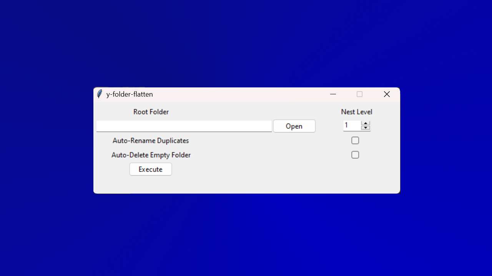

<!--
{
  "meta":
  {
    "type": "PCSoftware",
    "ready": true,
    "version": "1.0.0",
    "main":
    [
      "Python",
      "GUI"
    ],
    "tags":
    [
      "TKInter", 
      "UnitTests"
    ],
    "satisfaction": "5",
    "difficulty": "3",
    "challange": "2",
    "complexity": "2"
  }
}
-->

# y-folder-flatten ver 1.0.0

Easy script to flatten folders with provided nest level 

As .exe available on https://drive.google.com/file/d/1_G-gymGXVin8DnhtnRhnLjIXHBajb3Td/view?usp=sharing
Let me know if the link expired (The link is also reviewed by google, I might try different hosting at later time)

Uses *Python 3.12*
Made in *PyCharm*

With nest level of minimum 1, simple command line/tkinter app to flatten nested folders up to a provided level.

Have you ever downloaded a bunch of files, and all of them were in separate folders? What about music? This tool allows 
you to unload all the files into a single root folder and clean up all the unneeded directories. 

If you have any idea what could be added, feel free to message me or just improve it yourself.

## Instructions

To test basic functionality of the app, go to ./Test folder.
To execute TKInter App go to ./Application/TKInterApplication.py
Executing application normally will open command line version of application.

**The script ***wasn't*** tested thoroughly, and you should use it with caution! I do not take responsibility for your files and system integrity, use with caution.**

## What could be improved:
- Some of the code has potential for asynchronous execution, not sure if it would actually speed the application up
